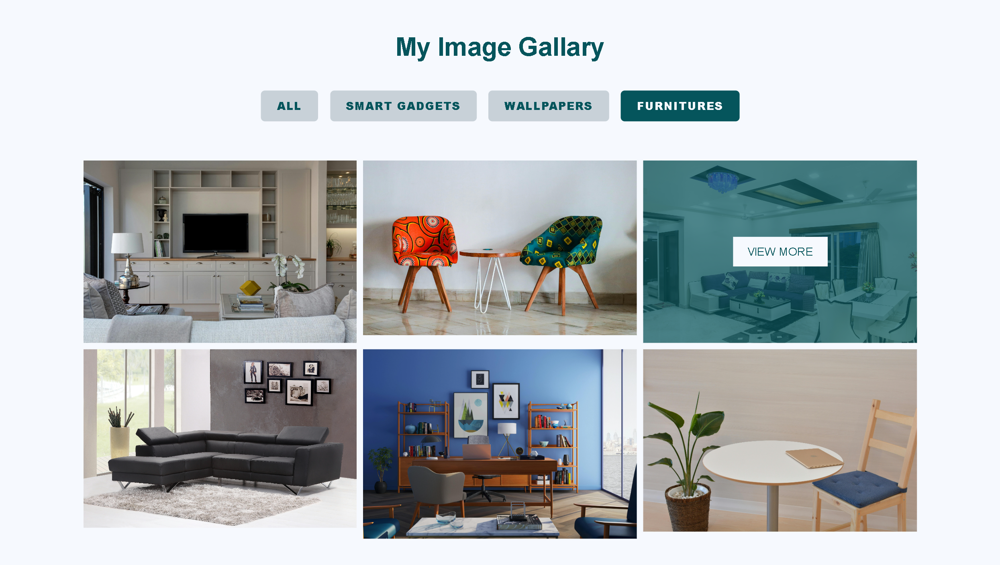

# 🖼️ My Image Gallery

Welcome to **My Image Gallery**—a project where I individually designed and developed a sleek, interactive gallery showcasing images across various categories: **Smart Gadgets**, **Wallpapers**, and **Furniture**. This gallery is responsive and built using HTML, CSS, and JavaScript to provide a seamless browsing experience.

## ✨ Project Overview

The gallery features four main sections:

### **All Images**: Browse the entire collection in one place.

### **Smart Gadgets**: Explore the latest in tech with high-quality images of smart gadgets and accessories.

### **Wallpapers**: Aesthetic wallpapers ranging from abstract designs to scenic landscapes.

### **Furniture**: Stylish furniture pieces to inspire your interior design projects.

## 📂 View More Functionality

To enhance user interaction, a **"View More"** button is available in each category:

- **Initial Display**: Shows a select few images to maintain a clean interface.
- **Lazy Loading**: Clicking "View More" loads additional images without affecting performance.

This feature ensures users can explore more content at their pace without overwhelming them upfront.

## 🚀 Project Features

- **Responsive Design**: Ensures optimal viewing on all devices.
- **Filterable Categories**: Easy navigation through different sections.
- **Interactive Hover Effects**: Subtle animations enhance user engagement.
- **Modern Aesthetics**: Clean, minimalist design with a consistent color scheme.
